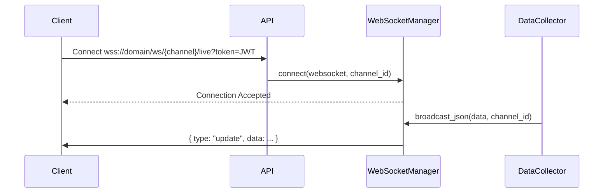

# Services

## WebSocket Manager

The WebSocket Manager (`websocket_manager.py`) handles real-time connections for live updates to the frontend.

### Architecture



### Channels

- `catalyst`: Real-time events (Catalyst Ledger)
- `glass`: TVL and Fees updates (Glass Ledger)
- `human`: Sentiment updates (Human Ledger)
- `exchange`: Price updates (Exchange Ledger)

### Integration

To broadcast data:

```python
from app.services.websocket_manager import manager

await manager.broadcast_json(
    {"type": "price_update", "data": {"btc": 50000}}, 
    "exchange"
)
```
