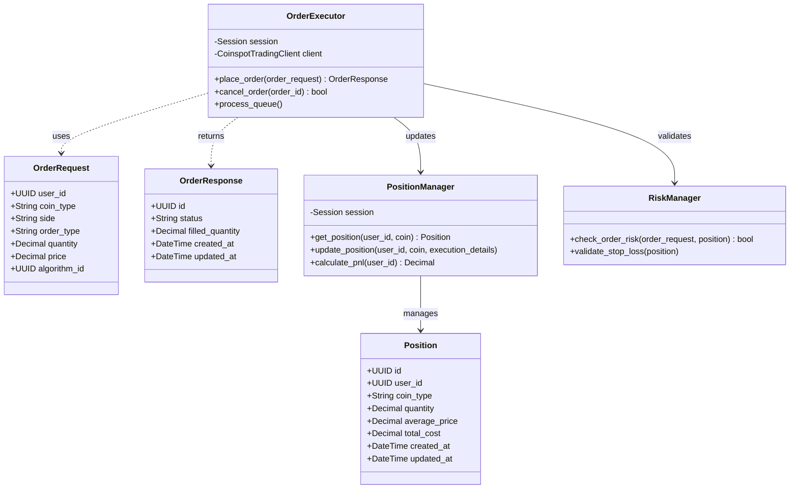

# Trading Engine Services

## System Overview

The Trading Engine encapsulates the logic for executing orders, managing positions, and assessing risk. It interacts with the CoinSpot API for actual execution while maintaining local state in the database.

## Class Diagram

